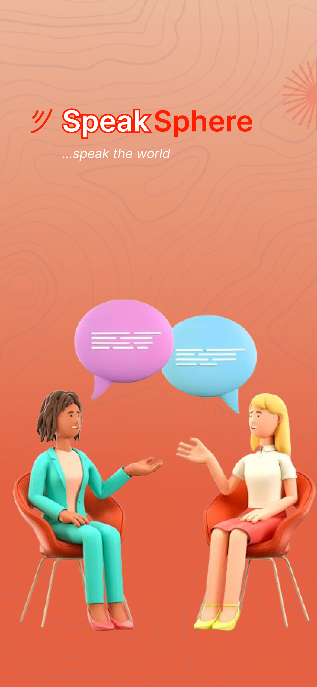
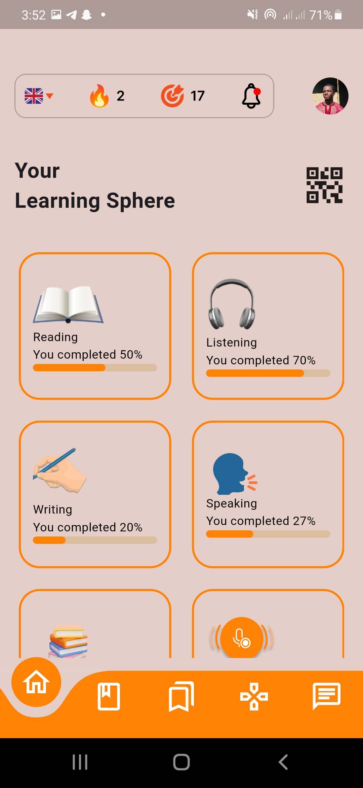
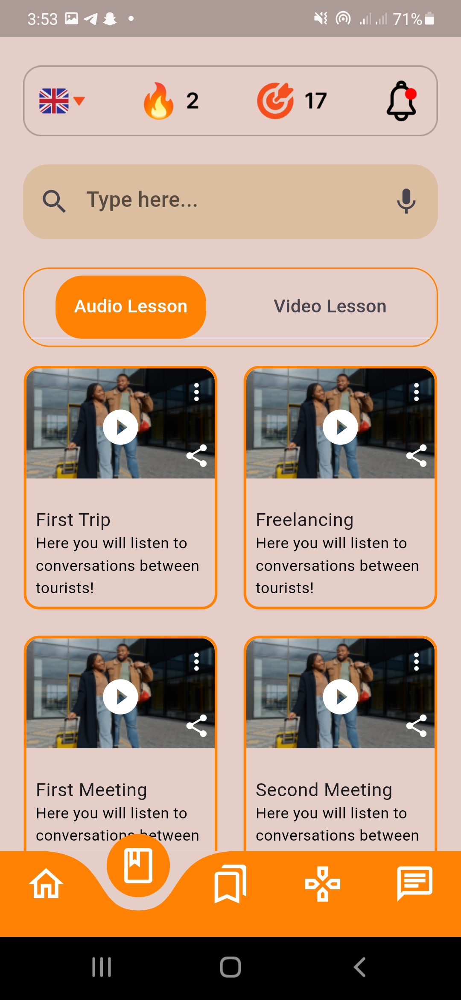
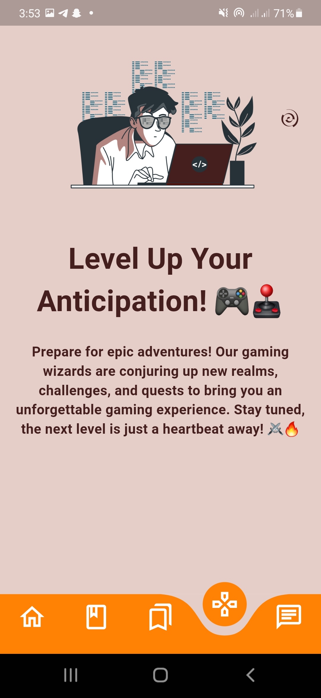

# UI Challenge

This project is a UI challenge, designed purely for the purpose of practicing and showcasing UI/UX skills. Please note that it does not include any backend functionality.

## App Screenshot

*Splash Screen*

*Onboarding*

*Home page*

*Lesson Page*

*Exercise Page*

*Game Page*

*Chat Page*